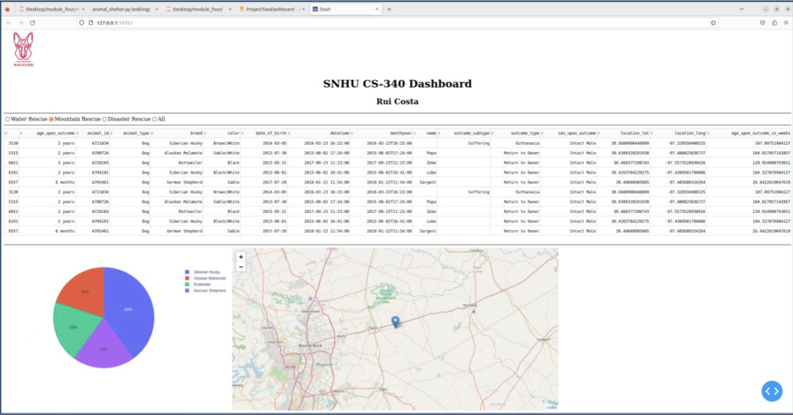

# Rui Costa CS 340 Final Project

## About the Project/Project Title
Grazioso Salvare is a company specializing in training dogs for search-and-rescue missions. They require a system that can effectively identify and classify potential dogs suitable for this purpose. To meet their requirements, this project aims to develop an application that enables seamless communication and functionality between the client and server. Specifically, it will focus on creating an application to "analyze and categorize available dogs using existing data obtained from animal shelters".

## Motivation
The motivation behind this project lies in the critical need to streamline the identification and categorization of potential dogs for search-and-rescue operations. Grazioso Salvare recognizes the inefficiencies and challenges posed by the current lack of a standardized system. By developing an innovative application that utilizes existing data from animal shelters, the project aims to automate and accelerate the process, ultimately enhancing the effectiveness and efficiency of search-and-rescue missions. This solution has the potential to not only benefit Grazioso Salvare but also serve as a model for other organizations involved in similar efforts, contributing to the overall improvement of search-and-rescue operations and creating a safer environment for all.

## Functionality
The main feature of this project is the ability to view data in a filtered manner, which is retrieved from a database through a Python module. The data is then presented in a user-friendly web dashboard, customized with the company's branding. To enhance data understanding, the dashboard includes interactive widgets that provide visual representations of the data. Additionally, users can dynamically filter the data within the dashboard, allowing for real-time adjustments and exploration.

## Tools Used
- MongoDB: MongoDB proves to be an exceptional tool for scalable applications and agile projects. Its document-oriented and NoSQL nature provides remarkable flexibility and stability, especially in scenarios with numerous concurrent users.
- Python: Python serves as an ideal programming language, seamlessly integrating with MongoDB's built-in functionality. The PyMongo driver library enables effortless manipulation and iteration through compatibility between dictionaries and lists.
- Jupyter Notebook: The client-side dashboard was developed using Jupyter Notebook, a powerful platform that combines an integrated development environment (IDE) with a data science environment. Supporting multiple programming languages and accessible as a web-based tool, Jupyter Notebook offers user-friendly features and convenient web accessibility.
- Plotly and Dash: To enhance the visual representation of data, Plotly and Dash were employed. Plotly, a versatile graphing and analytics library compatible with Python and various other languages, enables the creation of insightful visualizations. Dash, a Python framework specifically designed for building web-based applications, complements Plotly by providing the necessary tools for constructing interactive graphs and widgets within the web-based dashboard. This combination of Plotly and Dash ensures a visually appealing and interactive user interface for data analysis and exploration.

## Getting Started
### MongoDB Connection and User Authentication
To use the module, you must first connect to your MongoDB database. This is done in the constructor of the AnimalShelter class, where you provide your MongoDB username, password, hostname, port, database, and collection.

### Create, Read, Update, and Delete Operations
The Create, Read, Update, and Delete operations are the core functionalities of this module. They provide comprehensive data management capabilities, allowing you to insert new documents into your MongoDB collection, retrieve documents based on specified criteria, modify existing documents, and remove documents from your collection.

- Create Operation: Allows you to insert new documents into your collection. The create method requires a document (a dictionary in Python) as a parameter.
- Read Operation: Allows you to retrieve documents based on a provided query. The read method requires a query (a dictionary in Python) as a parameter.
- Update Operation: Allows you to modify existing documents in the collection that match a provided query.

 The update method requires two parameters: a query to identify the documents to update, and data representing the new values to apply to the identified documents.
- Delete Operation: Allows you to remove documents from the collection that match a provided query. The delete method takes a query parameter to identify the documents to delete.

To get started with the module, you need to import it into your Python script and establish a connection with your MongoDB database. You can then use the create, read, update, and delete methods as shown in the Usage section below. These methods provide the flexibility needed for dynamic and responsive data management in your application.

### Installation
This module uses the `pymongo` library to interact with MongoDB. You can install `pymongo` with pip:
```
pip install pymongo
```

To use this module as a local module from a Git repository, you must clone the repository to your local machine and then import it into your Python script. Here are the steps:

1. Clone the Git repository to your local machine:
```
git clone https://github.com/your_username/mongodb_crud_module.git
```

2. Navigate to the directory where you cloned the repository.
```
cd mongodb_crud_module
```

3. Now you can import the module in your Python script like so:
```python
from mongodb_crud_module import AnimalShelter
```

Please make sure that your Python script is either in the same directory as the `mongodb_crud_module` or add the path to the `mongodb_crud_module` to your system's PYTHONPATH or to the Python path in your script:
```python
import sys
sys.path.insert(0, '/path/to/your/module')
from mongodb_crud_module import AnimalShelter
```

Remember, you must also have `pymongo` installed in your Python environment, as the module depends on it.

## Usage
This module is intended to facilitate Create, Read, Update, and Delete operations on MongoDB collections. It is particularly effective in managing data from an animal shelter collection.

### Create Operation
The Create operation lets you insert new documents into the specified MongoDB collection. Here's how to use it with your AnimalShelter class:
```python
from AnimalShelter import AnimalShelter

# Initialize the class with your MongoDB credentials and the specific database and collection
shelter = AnimalShelter(username="Your_Username", password="Your_Password", hostname="Your_Hostname", port=Your_Port, database="Your_Database", collection="Your_Collection")

# Insert a new document into the collection
shelter.create({'animal': 'Dog', 'breed': 'Labrador', 'name': 'Max', 'age': 5})
```

### Read Operation
The Read operation helps retrieve specific documents from the MongoDB collection based on a query. Here's a demonstration of its usage:
```python
from AnimalShelter import AnimalShelter

# Initialize the class with your MongoDB credentials and the specific database and collection
shelter = AnimalShelter(username="Your_Username", password="Your_Password", hostname="Your_Hostname", port=Your_Port, database="Your_Database", collection="Your_Collection")

# Retrieve documents from the collection that match the query
animals = shelter.read({'animal': 'Dog'})

# Print all the dogs in the shelter
for animal in animals:
    print(animal)
```
Remember to replace "Your_Username", "Your_Password", "Your_Hostname", Your_Port, "Your_Database", and "Your_Collection" with your MongoDB credentials, the name of your database, and the name of your collection, respectively.

### Update Operation
The Update operation allows you to modify existing documents in your specified MongoDB collection. The update

 method in the AnimalShelter class accepts two parameters: query and data.

`query` is a dictionary that specifies the criteria for the selection of documents to be updated. This can be thought of as the "search condition" for the documents you want to update.

`data` is another dictionary that specifies the new data to be updated in the selected documents.
```python
from AnimalShelter import AnimalShelter

# Initialize the class with your MongoDB credentials and the specific database and collection
shelter = AnimalShelter(username="Your_Username", password="Your_Password", hostname="Your_Hostname", port=Your_Port, database="Your_Database", collection="Your_Collection")

# Define a query for documents where the name is 'lovemydog' and update those documents to have a 'type' of 'cat'
query = {"name": "lovemydog"}
data = {"type": "cat"}
result = shelter.update(query, data)
print(result)
```

### Delete Operation
The Delete operation allows you to remove documents from your specified MongoDB collection. The delete method in your AnimalShelter class takes a single parameter: query.

`query` is a dictionary that specifies the criteria for the selection of documents to be deleted. This is similar to the query in the update method.

Here is an example of how to use the delete operation:
```python
from AnimalShelter import AnimalShelter

# Initialize the class with your MongoDB credentials and the specific database and collection
shelter = AnimalShelter(username="Your_Username", password="Your_Password", hostname="Your_Hostname", port=Your_Port, database="Your_Database", collection="Your_Collection")

# Delete the document where the name is 'lovemydog'
query = {"name": "lovemydog"}
result = shelter.delete(query)
print(result)
```

## Getting Started with the Dashboard
To enable interactivity in the dashboard, which functions as the client-side component, various features have been incorporated. Users' essential requirements such as Mountain Rescue or Disaster Rescue and a reset function to restore the widgets to their original unfiltered state as shown in Figure A.



To launch the notebook and run the server to view the dashboard, follow the steps below:

1. Ensure you have Jupyter Notebook installed on your computer. If not, you can install it by following the instructions provided at https://jupyter.org/install.

2. Open the Jupyter Notebook application or navigate to the desired directory using the command prompt or terminal.

3. Locate the notebook file associated with the dashboard project (with a file extension ".ipynb") and open it within the Jupyter Notebook interface.

4. Once the notebook is open, navigate to the cell containing the code for running the server. This cell should typically include the necessary import statements and server configuration.

5. Execute the cell by clicking on it and then either pressing the "Run" button in the toolbar or using the keyboard shortcut (usually Shift + Enter).

6. After executing the cell, the server will start running, and the dashboard should be accessible. You can typically access the dashboard by opening a web browser and entering the URL provided in the notebook output, such as "http://localhost:port-number".

7. The web-based dashboard should now be visible, allowing you to interact with the map, select data points, and utilize the filtering options based on the specified requirements.

**Note:** Please ensure that you have all the necessary dependencies and libraries installed as specified in the project documentation or requirements file to ensure smooth execution of the notebook and proper functioning of the dashboard.


Your feedback and suggestions are valuable to us and can shape the future of this project. We appreciate your support and contributions!

## Contact
Rui Costa